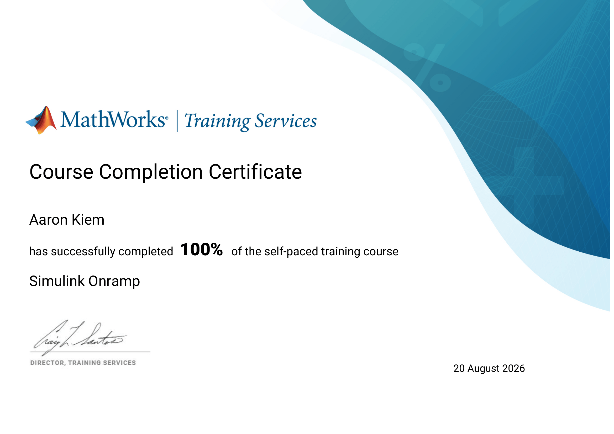
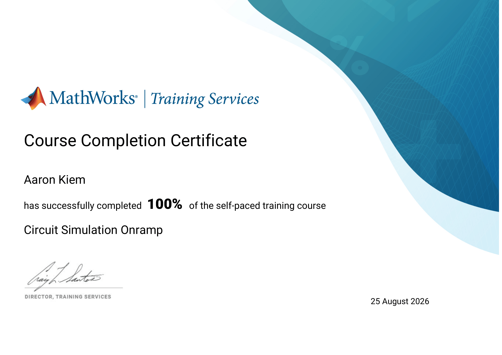

# Certifications

## MATLAB

[View Certificate (PDF)](../certificates/matlab.pdf)

MATLAB Onramp demonstrates basic navigation of MATLAB coding.

---

## Simulink

[View Certificate (PDF)](../certificates/simulink.pdf)

Simulink Onramp demonstrates basic navigation of MATLAB's simulink features.

---

## Simscape

[View Certificate (PDF)](../certificates/simscape.pdf)

Simscape Onramp demonstrates basic navigation of MATLAB's simscape features.

---

## Power Electronics

[View Certificate (PDF)](../certificates/power-electronics.pdf)

Power Electronics Simulation Onramp demonstrates basic understanding of utalizing simscape for modeling power converters such as buck converters.
---

## Circuit Simulation

[View Certificate (PDF)](../certificates/circuit-simulation.pdf)

Circuit Simulation Onramp demonstrates basic understanding of utalizing simscape for simulating analog electrical circuits.
