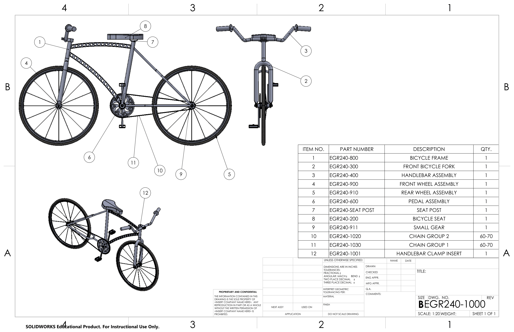

# Projects

## SolidWorks Bicycle

**Tech Stack:** SolidWorks 3d component modling, SolidWorks drawing, SolidWorks Assembly

[View Project Result (PDF)](../02-Projects/Solidworks/Bicycle.pdf)

[Download Project (Zip)](../02-Projects/Solidworks/Bicycle-Project.zip)

Created individual components, drawing files, and assembled a complete bicycle in SolidWorks

---

## EGR 314 Project: PCB metal detection system for an exploration rover

**Tech Stack:** Solidworks modeling, 3D printing, KiCAD circuit/PCB outlining, soldering, MPlab x IDE programming, Pic18f42k47, ESP32, multi-system connection

  

    <iframe
      src="https://www.youtube.com/embed/CgNYh9vksoY"
      title="YouTube video player"
      frameborder="0"
      allow="accelerometer; autoplay; clipboard-write; encrypted-media; gyroscope; picture-in-picture; web-share"
      allowfullscreen
      style="position: absolute; top: 0; left: 0; width: 100%; height: 100%;">
    </iframe>
  

Designed the metal detection system for the exploration rover using an LDC1101 inductance to digital converter. Success was limited due to design error and fixed through soldering. Result: system was working for short period, but failed across traveling period.

[View Individual Repo](https://aaronkiem.github.io/)

[View Team Repo](https://egr314-s-2026-202.github.io/)

---

## EGR 202 Project: Clap Light system

**Tech Stack:** MPlab x IDE programming, breadboard, Pic18f42k47, multi-system connection

  

    <iframe
      src="https://www.youtube.com/embed/y6O_NVVPS9g"
      title="YouTube video player"
      frameborder="0"
      allow="accelerometer; autoplay; clipboard-write; encrypted-media; gyroscope; picture-in-picture; web-share"
      allowfullscreen
      style="position: absolute; top: 0; left: 0; width: 100%; height: 100%;">
    </iframe>
  

Designed the clap light sound toggle system using an CMEJ-4618-42-L177 electret microphone.

[View Individual Repo](https://aaronkiem.github.io/AaronKiem304-Old.github.io/)

[View Team Repo](https://asu-egr304-2025-f-204.github.io/)

---

## EGR 201 Project: Five Coded Lock Boxes

**Tech Stack:** Arduino programming, 3D modeling, 3D printing

Designed five 3D printed boxes and programmed Arduino to unlock independent box with corresponding pin code.

  

    <iframe
      src="https://www.youtube.com/embed/bMcC9g9C1c0"
      title="YouTube video player"
      frameborder="0"
      allow="accelerometer; autoplay; clipboard-write; encrypted-media; gyroscope; picture-in-picture; web-share"
      allowfullscreen
      style="position: absolute; top: 0; left: 0; width: 100%; height: 100%;">
    </iframe>
  

[View Team Project Manual (PDF)](../02-Projects/Final-Report-Manual.pdf)

[View Team Project Picture (PDF)](../02-Projects/Final-Project-Demonstration.pdf)

---

## Solo Project: Blender Animation

**Tech Stack:** 3D modeling, Rigging, Key Posing, Compositing, Texturing

One of many small solo projects using the Blender animation and modeling software. Other projects advance personal learning into color grading, texturing, lidar scanning, VFX tracking marker applying, and node programming.

  

    <iframe
      src="https://www.youtube.com/embed/LX3g3UL9CwE"
      title="YouTube video player"
      frameborder="0"
      allow="accelerometer; autoplay; clipboard-write; encrypted-media; gyroscope; picture-in-picture; web-share"
      allowfullscreen
      style="position: absolute; top: 0; left: 0; width: 100%; height: 100%;">
    </iframe>
  

